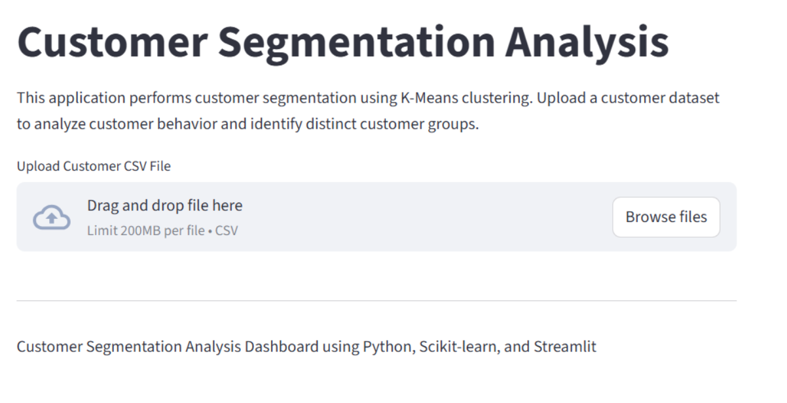

# 📊 Customer Segmentation Analysis Dashboard

An end-to-end Data Analytics and Machine Learning project that analyzes customer purchasing behavior using K-Means clustering and presents insights through an interactive Streamlit dashboard.

**Project Type:** Data Analysis / Machine Learning / Data Visualization  
**Dataset Size:** 200 Customers  
**Tools:** Python, Pandas, Scikit-learn, Seaborn, Matplotlib, Streamlit, Jupyter Notebook  
**Key Focus:** Customer segmentation, clustering analysis, customer behavior insights

---

## Dashboard Preview

---

## Project Overview

This project analyzes customer behavior data to identify distinct customer groups based on annual income and spending patterns. The project demonstrates an end-to-end analytics workflow including data cleaning, exploratory data analysis, K-Means clustering, business insight generation, and interactive dashboard development using Streamlit.

---

## Objective

The objective of this project is to segment customers into distinct groups based on their purchasing behavior using K-Means clustering. By identifying customer segments, businesses can better understand customer behavior, improve targeted marketing strategies, enhance customer engagement, and optimize business decision-making.

---

## Dataset

The dataset used in this project contains customer demographic and spending information collected from a retail store customer database.

The dataset includes the following features:

- Customer ID  
- Gender  
- Age  
- Annual Income (k$)  
- Spending Score (1–100)  

The dataset contains **200 customer records** used for clustering analysis and visualization.

---

## Project Workflow

The project followed a structured analytics and machine learning workflow:

### Data Cleaning
The dataset was validated and cleaned using **Pandas** by checking for missing values, duplicate records, and data consistency.

### Exploratory Data Analysis
Exploratory data analysis was performed using **Seaborn** and **Matplotlib** to analyze customer demographics, spending behavior, income distribution, and feature correlations.

### Feature Selection
Annual Income and Spending Score were selected as the primary features for customer segmentation analysis.

### Elbow Method Analysis
The **Elbow Method** was implemented using **Scikit-learn** to determine the optimal number of customer clusters.

### K-Means Clustering
Customer segmentation was performed using the **K-Means clustering algorithm** to identify distinct customer groups based on spending patterns.

### Dashboard Development
An interactive **Streamlit dashboard** was developed to enable dynamic customer segmentation analysis, cluster visualization, and business insight generation.

---

## Key Insights

- Customers were successfully segmented into **5 distinct customer groups** using K-Means clustering.
- High-income and high-spending customers represent premium customers with strong business value.
- High-income but low-spending customers indicate untapped marketing opportunities.
- Low-income but high-spending customers demonstrate highly engaged purchasing behavior.
- Customer segmentation enables businesses to improve targeted marketing strategies and personalized recommendations.
- The interactive dashboard allows dynamic cluster visualization and customer behavior analysis.

---

## Skills Demonstrated

- Data Cleaning  
- Exploratory Data Analysis  
- Machine Learning  
- K-Means Clustering  
- Elbow Method Analysis  
- Data Visualization  
- Streamlit Dashboard Development  
- Business Insights & Recommendation Analysis  
- Modular Python Project Architecture  
- Data Storytelling
